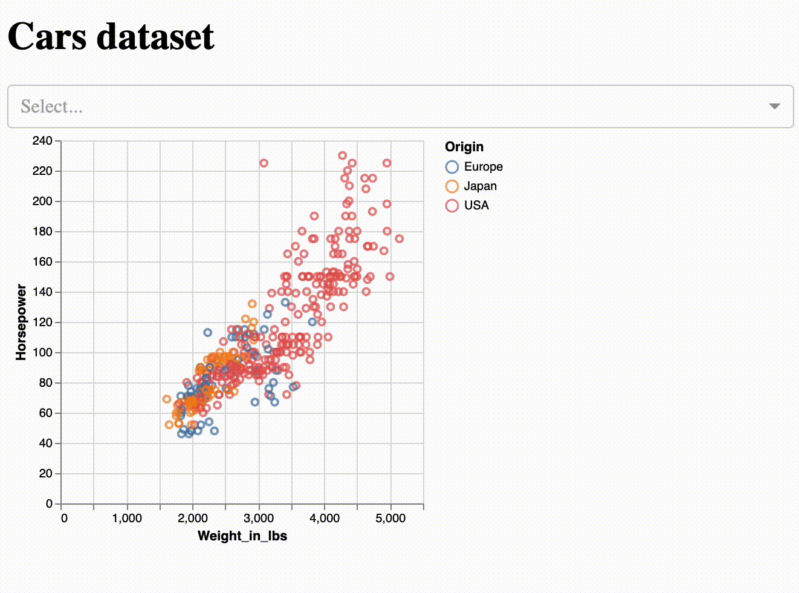

# Basic Altair Dash App

This is a basic example of how to create a Dash app with Altair plots.

Read more about it in the [blog post](https://medium.com/@farrandi19/unleash-the-power-of-your-data-c12259727ed9).

## Demo



## Quick Start

Before starting, make sure you are in the main directory of the project and have conda installed.

1. Install the conda environment:

```bash
conda env create -f environment.yml
```

2. Activate the environment:

```bash
conda activate basic-altair-dash-app
```

3. Run the app:

```bash
python app.py
```

## License

This project is licensed under the MIT License - see the [LICENSE](LICENSE) file for details.

## Contributors

@farrandi
